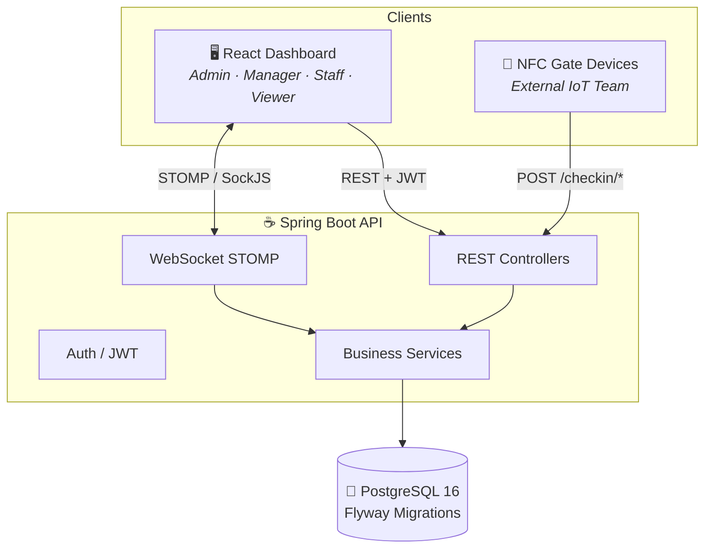
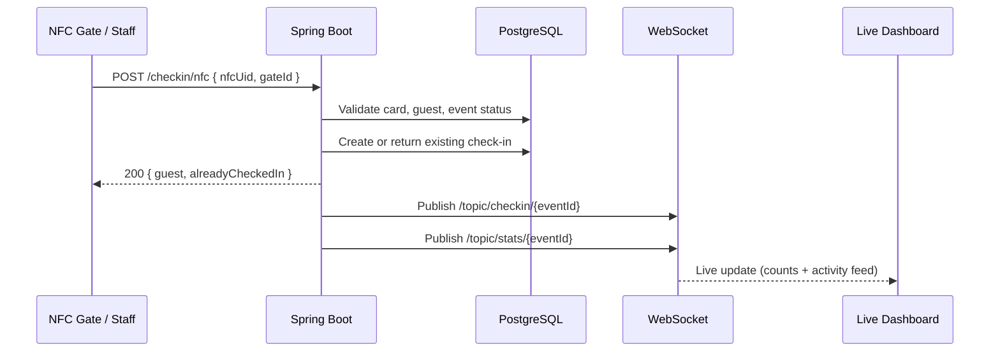

<div align="center">

# ✨ Occassia

### Wedding & Event Access Management Platform

<p>
  
</p>

<p>
  
  
  
  
  
</p>

<p>
  
  
  
  
</p>

**Manage guests. Assign NFC cards. Check in at the gate. Watch it all update live.**

[Quick Start](#-quick-start) ·
[Features](#-features) ·
[Architecture](#-architecture) ·
[API Docs](#-api-documentation) ·
[Developer Guide](./DEVELOPER.md) ·
[Demo Accounts](#-demo-accounts)

<br/>


</div>

---

## 📖 About

**Occassia** is a web-based event access management platform. It starts with weddings as the primary use case and is architected from day one to support conferences, parties, corporate dinners, and any event that needs guest management and controlled entry.

The system has two independent layers:

| Layer | Who Uses It | How It Connects |
|-------|-------------|-----------------|
| **Web Platform** | Admins, event managers, check-in staff, viewers | React dashboard via REST + WebSocket |
| **IoT / Smart Devices** | NFC/RFID readers at venue gates | REST check-in API, HID readers, Web NFC, or local serial bridge |

> No photo capture. No payment processing. Payment is tracked as a manual `paid` boolean flag.

NFC hardware can integrate through HID/keyboard mode, browser Web NFC, or the local serial bridge. See [CONFIGURE.md](./CONFIGURE.md) for reader compatibility and setup. The serial bridge handles newline-terminated UID registration; gate check-in uses the authenticated `/api/v1/checkin/nfc` contract described below.

---

## ✨ Features

<table>
<tr>
<td width="50%">

### 🎫 Guest Management
- Single add & CSV/Excel batch import
- Dynamic per-event categories (VIP, Family, etc.)
- Confirmed / paid status tracking
- Auto-generated QR tokens per guest

</td>
<td width="50%">

### 💳 NFC Card System
- Org-level card assets (reusable across events)
- Single UID registration (no batch-code field)
- HID, Web NFC, and serial/SDK reader support
- Fast scan-and-assign workflow
- LOST / DAMAGED status handling

</td>
</tr>
<tr>
<td>

### 🚪 Check-in
- NFC tap, QR scan, or manual check-in
- Duplicate taps return success with warning flag
- Gate assignment per check-in
- Ticket printed tracking

</td>
<td>

### 📊 Live Operations
- Real-time dashboard via WebSocket
- Category breakdown charts
- Gate activity feed
- CSV attendance export

</td>
</tr>
<tr>
<td>

### 🔐 Security & Tenancy
- JWT authentication (8h access / 7d refresh)
- Role-based access control (5 roles)
- Organization-level data isolation
- Append-only audit log

</td>
<td>

### 🏗️ Platform Ready
- Multi-tenant organizations
- One-way event lifecycle (DRAFT → ACTIVE → CLOSED → ARCHIVED)
- OpenAPI / Swagger documentation
- Docker Compose for local dev

</td>
</tr>
</table>

---

## 🏛️ Architecture



### Real-time flow (check-in)



---

## 🚀 Quick Start

### Prerequisites

| Tool | Version |
|------|---------|
| Java | 21+ |
| Maven | 3.9+ |
| Node.js | 20+ |
| PostgreSQL | 16+ (or Docker) |

### Option A — Docker (recommended)

```bash
git clone <your-repo-url>
cd APP
docker compose up --build
```

| Service | URL |
|---------|-----|
| Frontend | http://localhost:5173 |
| Backend API | http://localhost:8080/api/v1 |
| Swagger UI | http://localhost:8080/swagger-ui.html |
| PostgreSQL | `localhost:5432` |

### Option B — Manual

**1. Database**

```bash
# Docker (postgres only)
docker compose up postgres -d

# Or create locally:
# Database: occassia | User: occassia | Password: occassia
```

**2. Backend**

```bash
cd backend
mvn spring-boot:run
```

**3. Frontend**

```bash
cd frontend
npm install
npm run dev
```

Open **http://localhost:5173** and sign in with a demo account below.

---

## 🔑 Demo Accounts

All seeded passwords: **`admin123`**

| Email | Role | Access |
|-------|------|--------|
| `admin@occassia.com` | SUPER_ADMIN | All organizations, system-wide |
| `jane@elegantevents.com` | ADMIN | Full org access — Elegant Events Co. |
| `mike@elegantevents.com` | EVENT_MANAGER | Guests, cards, events |
| `sam@elegantevents.com` | CHECKIN_STAFF | Check-in screen + read-only views |
| `vera@elegantevents.com` | VIEWER | Dashboard & reports (read-only) |

A sample **Kiprotich Wedding** event (DRAFT) is pre-seeded with VIP / Family / Regular categories and two gates.

---

## 📡 API Documentation

Occassia uses **SpringDoc OpenAPI 3** (Swagger). Documentation lives on the **backend only** — it is not embedded in the React UI.

| Endpoint | Description |
|----------|-------------|
| [http://localhost:8080/swagger-ui.html](http://localhost:8080/swagger-ui.html) | Interactive Swagger UI — try endpoints in browser |
| [http://localhost:8080/v3/api-docs](http://localhost:8080/v3/api-docs) | OpenAPI 3 JSON spec |
| [http://localhost:8080/v3/api-docs.yaml](http://localhost:8080/v3/api-docs.yaml) | OpenAPI 3 YAML spec |
| [http://localhost:8080/api/v1/docs](http://localhost:8080/api/v1/docs) | Discovery JSON with links to all doc endpoints |

### Authenticating in Swagger

1. `POST /api/v1/auth/login` with a demo email/password
2. Copy the `token` from the response
3. Click **Authorize** → enter `Bearer <your-token>`

### IoT check-in contract

```http
POST /api/v1/checkin/nfc
Content-Type: application/json
Authorization: Bearer <staff-token>

{
  "nfcUid": "04:A3:FF:12:BC",
  "gateId": "00000000-0000-0000-0000-000000000301"
}
```

See [DEVELOPER.md](./DEVELOPER.md) for the full response contract, error codes, and WebSocket topics.

For reader, card, serial-port, UID-format, and hardware setup instructions, see [CONFIGURE.md](./CONFIGURE.md).

---

## 🗂️ Project Structure

```
APP/
├── backend/                 # Spring Boot 3.4 API
│   ├── src/main/java/com/occassia/
│   │   ├── auth/            # JWT, login, refresh
│   │   ├── event/           # Events, status transitions
│   │   ├── guest/           # Guests, CSV import, QR
│   │   ├── card/            # NFC card registry
│   │   ├── checkin/         # NFC / QR / manual check-in
│   │   ├── dashboard/       # Live stats
│   │   ├── websocket/       # STOMP publisher
│   │   └── config/          # Security, CORS, OpenAPI
│   └── src/main/resources/db/migration/   # Flyway SQL
├── frontend/                # React 19 + Vite + Tailwind
│   └── src/
│       ├── pages/           # Route-level views
│       ├── api/             # Axios API client
│       ├── store/           # Zustand auth state
│       └── lib/             # WebSocket, utilities
├── docker-compose.yml
├── README.md                # ← You are here
└── DEVELOPER.md             # Full developer guide
```

---

## 🛠️ Tech Stack

| Layer | Technology |
|-------|------------|
| Backend | Java 21, Spring Boot 3.4, Spring Security, Spring Data JPA |
| Database | PostgreSQL 16, Flyway |
| Auth | JWT (JJWT), BCrypt |
| Real-time | Spring WebSocket, STOMP over SockJS |
| API Docs | SpringDoc OpenAPI 3 / Swagger UI |
| Import | Apache POI, OpenCSV |
| QR Codes | ZXing |
| Frontend | React 19, TypeScript, Vite 8 |
| Styling | Tailwind CSS 4 |
| State | Zustand |
| Charts | Recharts |
| HTTP | Axios |

---

## 🌐 WebSocket Topics

Connect to `ws://localhost:8080/ws` using STOMP over SockJS.

| Topic | Trigger | Payload |
|-------|---------|---------|
| `/topic/checkin/{eventId}` | Any check-in | `{ guestId, guestName, category, gateId, checkedInAt }` |
| `/topic/stats/{eventId}` | Any check-in | `{ totalGuests, checkedIn, remaining, byCategory }` |
| `/topic/card/{uid}` | Card status change | `{ uid, status, assignedGuestId }` |

---

## 👥 Roles & Permissions

| Action | SUPER_ADMIN | ADMIN | EVENT_MANAGER | CHECKIN_STAFF | VIEWER |
|--------|:-----------:|:-----:|:-------------:|:-------------:|:------:|
| Create / edit event | ✅ | ✅ | ❌ | ❌ | ❌ |
| Add / import guests | ✅ | ✅ | ✅ | ❌ | ❌ |
| Assign NFC cards | ✅ | ✅ | ✅ | ❌ | ❌ |
| Check in guests | ✅ | ✅ | ✅ | ✅ | ❌ |
| View live dashboard | ✅ | ✅ | ✅ | ✅ | ✅ |
| Export reports | ✅ | ✅ | ✅ | ❌ | ✅ |
| Manage users | ✅ | ✅ | ❌ | ❌ | ❌ |
| View audit logs | ✅ | ✅ | ❌ | ❌ | ❌ |

---

## 🧪 Health Check

After starting the backend, verify everything is running:

```bash
# API discovery
curl http://localhost:8080/api/v1/docs

# Login
curl -X POST http://localhost:8080/api/v1/auth/login \
  -H "Content-Type: application/json" \
  -d '{"email":"jane@elegantevents.com","password":"admin123"}'
```

---

## 📋 Environment Variables

| Variable | Default | Description |
|----------|---------|-------------|
| `SPRING_DATASOURCE_URL` | `jdbc:postgresql://localhost:5432/occassia` | Database JDBC URL |
| `SPRING_DATASOURCE_USERNAME` | `occassia` | DB username |
| `SPRING_DATASOURCE_PASSWORD` | `occassia` | DB password |
| `JWT_SECRET` | dev default in `application.yml` | **Change in production** |

---

## 🤝 Contributing

1. Read [DEVELOPER.md](./DEVELOPER.md) before making changes
2. Create a feature branch from `main`
3. Ensure `mvn package` and `npm run build` pass
4. Open a pull request with a clear description

---

## 📄 License

Proprietary — Occassia v1.0. All rights reserved.

---

<div align="center">


**Occassia** — *Every guest. Every gate. One platform.*

</div>
